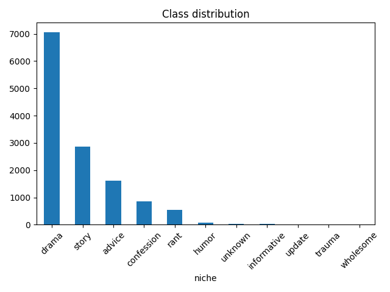

[](https://huggingface.co/datasets/atin5551/reddit-story-niche-classification-dataset)
[](LICENSE)
> 📥 Downloads last 30 days: **17**

# 🧠 Reddit Niche Classification Dataset

This dataset contains 13,061 Reddit posts annotated with a custom `niche` label (e.g. `advice`, `drama`, `humor`, `unknown`, etc). It includes structured features engineered from post metadata, not raw text — making it ideal for lightweight classification models.

## 🧾 Schema

| Column             | Type      | Description                                         |
|--------------------|-----------|-----------------------------------------------------|
| `title`            | string    | Post title                                          |
| `selftext`         | string    | Post body text                                      |
| `subreddit`        | string    | Subreddit the post belongs to                       |
| `flair`            | string    | Flair attached to the post                          |
| `score`            | int       | Total Reddit score (upvotes - downvotes)            |
| `num_comments`     | int       | Number of comments the post received                |
| `upvote_ratio`     | float     | Ratio of upvotes to total votes                     |
| `created_utc`      | timestamp | Timestamp of post creation (UTC)                    |
| `id`               | string    | Unique Reddit post ID                               |
| `url`              | string    | Link to the original Reddit post                    |
| `title_length`     | int       | Number of words in the post title                   |
| `selftext_length`  | int       | Number of words in the post body                    |
| `contains_question`| bool      | Whether the title contains a question mark          |
| `contains_capslock`| bool      | Whether the title includes all caps words           |
| `engagement_score` | float     | Combined metric: (score * upvote_ratio) + comments  |
| `hour_of_posting`  | int       | Hour (0–23) the post was created in UTC             |
| `niche`            | string    | Target label for classification (11 classes)        |

## 🏷️ Labels

| Label         | Description                                                  |
|---------------|--------------------------------------------------------------|
| `advice`      | Help-seeking posts, questions, dilemmas                      |
| `story`       | Personal anecdotes with a beginning, middle, and end         |
| `drama`       | High-stakes conflict, betrayal, gossip                       |
| `rant`        | Emotional venting or unfiltered frustration                  |
| `humor`       | Meme-like, comedic, shitpost-style content                   |
| `informative` | Tips, how-tos, PSAs, educational content                     |
| `confession`  | Vulnerable personal reveals or identity-based confessions    |
| `update`      | Updates on previous situations or developments               |
| `trauma`      | Distressing or traumatic experiences                         |
| `wholesome`   | Heartwarming, uplifting, or positive content                 |
| `unknown`     | Uncategorized or ambiguous niche                             |

## 📊 Dataset Size

- **Total rows**: 13,061  
- **Columns**: 17  
- **Classes**: 11

## 📊 Class Distribution



## 🧪 Usage

```python
from datasets import load_dataset

ds = load_dataset("atin5551/reddit-story-niche-classification-dataset")
print(ds["train"][0])
```

## 👤 Author

Made by **Atin Kumar Singh**  
MIT Licensed
